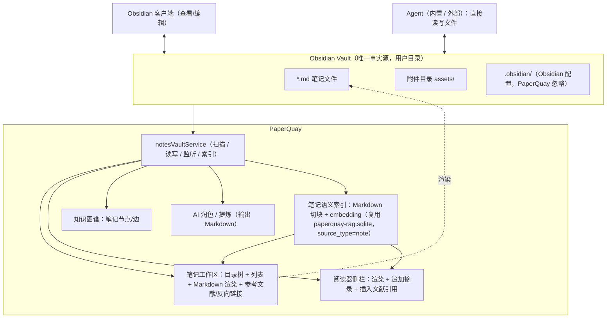

# PaperQuay 笔记系统 Vault-First 简化方案（Markdown 文件为唯一事实源）

- 日期：2026-09-25
- 状态：**方案已确认，待实施**（2026-09-25 确认：编辑方式 5.1=B、显示范围 5.2=C、AI 能力 5.5=A、笔记语义索引 12.5=已配置即默认开启；同日追加笔记语义检索设计 §12；本文档当前仍只做需求梳理与设计，不动代码）
- 范围：笔记子系统整体反转（`src/features/notes/`、`src/features/reader/` 笔记链路、`electron/backend/noteStore.cjs` / `noteCommands.cjs` / `noteVault.cjs`、`electron/mcp/knowledgeMcpService.cjs`、内置 Agent 笔记工具、知识图谱笔记数据源、WebDAV 备份）
- 关联文档：[笔记宪章](../notes-charter.md)、[笔记系统痛点与解决方案](./2026-09-24-notes-system-painpoints-and-solutions.md)、[MCP 集成指南](../MCP_AGENT_INTEGRATION.md)

## 0. 一句话结论

把笔记的**唯一事实源**从 `paperquay-notes.sqlite`（Tiptap JSON + 结构化锚点）反转为**用户的 Obsidian vault 目录（Markdown 文件）**；PaperQuay 退化为 vault 的「渲染器 / 检索器 / 图谱构建器 / 引用助手」，Obsidian 与任何文件型 Agent 都是这个目录的一等编辑者。

## 1. 需求梳理

### 1.1 用户明确要求（原话拆解）

| # | 原话 | 结构化需求 |
|---|------|-----------|
| R1 | 「笔记就存放在 obsidian 的文件夹」 | 笔记以 `.md` 文件存放在用户 Obsidian vault 目录，无二次存储 |
| R2 | 「obsidian 这个文件夹和 paperquay 是统一共用的」 | PaperQuay 与 Obsidian 读写同一目录、同一批文件；Obsidian 侧可查看、编辑 |
| R3 | 「读文献的侧栏，只要能正常渲染 md 文档即可」 | 阅读器侧栏：渲染当前文献相关笔记的 Markdown，不做富文本/结构化编辑 |
| R4 | 「能复制文献内容到笔记」 | 把 PDF/正文选区内容复制进笔记（文本 + 来源标注），不建锚点 |
| R5 | 「能插入这个笔记里内容引用的文献」 | 插入「文献级」引用（不定位到切片块）；笔记里能看出引用了哪些文献 |
| R6 | 「不需要确定到切片块，确定到哪个文献即可」 | 废弃锚点体系（anchorId / blockId / pageIndex / pdfLocation / bbox） |
| R7 | 「可以自己在笔记里写明是多少页什么位置，哪些是引用的原文」 | 页码/位置由用户手写或用简单文本表达；原文用引用块（`>`）表示 |
| R8 | 「正式的笔记模块，也只要正常渲染 md 文档即可，能分类，能引用文献等等」 | 笔记工作区：Markdown 渲染 + 分类（文件夹）+ 文献引用，不要求复杂编辑 |
| R9 | 「知识图谱可以正常构建」 | 笔记仍参与 PaperQuay 知识图谱（笔记↔笔记、笔记↔文献、笔记↔标签） |
| R10 | 「以后让 agent 直接在 obsidian 这个文件夹里改就行」 | Agent 通过文件系统直接读写 vault，无需经 SQLite/IPC 专用接口 |

### 1.2 明确不要的（降级或删除）

- 锚点 / 切片块绑定：`NoteAnchor`、`noteAnchorBlock`、`noteAnchorLink`、`pdfLocation`、`bbox`、MinerU `blockId` 反查、锚点跳转与降级还原。
- Tiptap JSON 作为存储格式：`content_json`/`content_html` 不再作为事实源（编辑与渲染都以 Markdown 文本为准）。
- 笔记 SQLite 库作为源：`paperquay-notes.sqlite` 停止写入（保留只读备份）。
- 富文本编辑器：`NoteEditor.tsx`（Tiptap，1963 行）与配套工具栏、块控件、拖拽手柄。
- vault「镜像同步」概念：现在的 `noteVault.cjs` 是「DB → 文件」单向镜像 + 条件回写，改为文件即源后该同步器整体废弃。

### 1.3 保留并强化的能力

- 阅读器侧栏笔记面板（渲染 + 摘录 + 引用）。
- 笔记工作区（分类 / 列表 / 渲染 / 引用 / 反向链接）。
- 知识图谱笔记节点（数据源换成文件扫描）。
- AI 润色、提炼（输出改为 Markdown 文本写回文件）。
- 内置 Agent / MCP / 外部 Agent 的笔记读写（改为文件级）。

### 1.4 现状快照（2026-09-25 实测）

| 项 | 现状 |
|----|------|
| 笔记数据 | `%APPDATA%/paperquay/PaperQuay/paperquay-notes.sqlite`：总记录 7 条、存活 **2 条**、文件夹 2 个、标签 3 个 |
| 已配置 vault | `C:\Users\yusen\Downloads\my-note`（已有 `.obsidian/`、`.paperquay-vault.json`，内含 2 篇导出笔记） |
| 导出文件形态 | frontmatter 带 `id/type/paperId/folder/tags/sources/createdAt/updatedAt/anchors`；正文已是 Markdown（`# 标题`、`## 小节`、引用块） |
| 用户实际写法 | 笔记标题里已手写「（学位论文 p.69，式(4.23)—(4.25)）」——正是 R7 的用法，说明结构化锚点确实不是必需品 |

**结论：当前笔记量极小（2 篇），是切换架构成本最低的时机，几乎无迁移负担。**

## 2. 目标架构



分层职责：

1. **文件层（源）**：vault 目录中的 `.md`；PaperQuay 不写入私有格式，所有信息对人类与其他工具可读。
2. **索引层（可丢）**：PaperQuay 进程内扫描得到的元数据索引（路径、标题、frontmatter、标签、`[[双链]]`、`paperquay://` 引用、mtime、hash）。**不落库**；重启后重建。性能不足时再考虑可删除的缓存文件。
3. **界面层**：渲染、分类、引用、图谱、AI 辅助——全部只读消费索引 + 按需写文件。

## 3. 文件契约（本方案的核心设计）

### 3.1 目录与命名

- vault 根 = 用户在设置中选择的目录（沿用配置键 `notesVaultDir`，语义从「同步目标」变为「笔记主目录」）。
- 分类 = 目录（文件夹树即分类树，与 Obsidian 完全一致）。
- 文件名 = 笔记标题；非法字符（`<>:"/\|?*` 与控制符）清洗；重名时追加短后缀。
- PaperQuay 忽略：`.obsidian/`、`.trash/`、`.` 开头的目录与文件、`node_modules/`。
- 删除笔记 = 移入系统回收站（`shell.trashItem`），不硬删。

### 3.2 frontmatter（只管理下列键，其余原样保留）

```yaml
paperId: paper_mtst6k44_031e9e84   # 可选：文献归属（阅读器侧栏过滤、图谱边）
tags: [文献素材, 过渡段建模]         # 可选：分类维度（正文 #tag 同样识别）
```

不写入：`id`（文件名即标识）、`type`、`folder`（目录即归属）、`createdAt/updatedAt`（文件 mtime 即时间）、`anchors`（不复存在）。

写入原则：**只增改上述受管键，绝不动用户自己写的 frontmatter**（`aliases`、`cssclass`、Obsidian 插件字段等一律保留）。

### 3.3 文献引用语法（对应 R5）

正文中的文献引用统一写作标准 Markdown 链接：

```markdown
[Lim(2024) 过渡段功率与能量近似模型](paperquay://paper/paper_mtst6k44_031e9e84)
```

- PaperQuay 渲染时把 `paperquay://paper/<paperId>` 链接识别为**文献芯片**（显示论文标题），点击打开文献。
- Obsidian 中是普通链接，显示文本可读；点击行为取决于系统是否注册 `paperquay://` 协议（P1 可选：Electron `setAsDefaultProtocolClient`）。
- 允许在链接文本或紧随的文本里写页码：`（P69）`——PaperQuay 不解析页码，仅呈现给用户（对应 R7）。

#### 3.3.1 引用的识别与容错（直接改 md 也不丢能力）

引用关系不存数据库、不依赖任何锚点，而是**每次扫描时从 Markdown 文本派生**。因此无论谁改文件（PaperQuay、Obsidian、Agent、外部编辑器），只要文本里的引用写法存在，能力就存在：

| 写法 | 识别结果 | 说明 |
|------|----------|------|
| `[任意文本](paperquay://paper/<paperId>)` | ✅ 精确引用（双向可用） | 首选形式；PaperQuay 所有插入操作都写这个形式 |
| frontmatter `paperId: <id>` | ✅ 笔记归属 | 笔记整体归属某文献，阅读器侧栏按此过滤 |
| frontmatter `paperIds: [id1, id2]` | ✅ 多文献引用（可选扩展） | 跨文献综述类笔记可显式列出 |
| 纯文本写「Lim(2024)…」 | ⚠️ 不自动关联 | 需要精确引用时请用上面任一种；可选标题模糊匹配默认关闭，避免误关联 |

其他规则：

- 论文 ID 稳定（`papers.id`，如 `paper_mtst6k44_031e9e84`）；被引文献被删除时，芯片降级显示「未知文献（id）」并保留原文，不丢信息。
- 右栏「参考文献」视图**实时从正文派生**（编号 + 点击打开文献），不写入文件；直接改 md 后刷新立即生效。
- 文献侧反向能力同时保留：文献详情 / 阅读器可查「哪些笔记引用了它」（全库扫描派生）。
- P1 新增两个入口降低手写成本：文献列表与阅读器的「复制引用」按钮（产出上述链接供粘贴到任何编辑器）、「复制摘录块」按钮。

### 3.4 摘录块格式（对应 R4、R7）

「复制文献内容到笔记」产生的文本：

```markdown
> 原文文本（逐字或节选）……

—— 摘自 [Lim(2024) 过渡段功率与能量近似模型](paperquay://paper/paper_mtst6k44_031e9e84)，P69
```

- 摘录正文是 Markdown 引用块，原文逐字保留。
- 来源行由 PaperQuay 自动填入（论文标题 + 引用链接 + 页码）；用户可自由修改。

### 3.5 其他约定

- 编码：UTF-8（写入不带 BOM；读取容忍 BOM）。
- 换行：保留文件原风格，仅修改被编辑的片段（追加式操作为主，避免整文件重写）。
- 图片/附件：PaperQuay 粘贴图片时写入 `<vault>/assets/`，插入 ``。
- 双链：沿用 Obsidian 语义 `[[笔记标题]]`（支持 `[[标题|别名]]`）；未创建的目标显示为「未创建」灰色节点。
- 不引入 PaperQuay 私有语法；除 `paperquay://` 链接外，所有内容都是普通 Markdown。

## 4. 模块改造清单

### 4.1 主进程（新增）

`electron/backend/notesVaultService.cjs`（新文件，替代 `noteStore.cjs` + `noteVault.cjs` 的职责）：

| 命令 | 说明 |
|------|------|
| `notes_vault_scan` | 递归扫描 `.md`，解析 frontmatter（受管键 + 保留其他键原文）、提取标题/标签/`paperquay://paper` 引用/`[[双链]]`/mtime/大小；返回索引数组 |
| `notes_vault_read` | 读取单文件（内容 + mtime + hash） |
| `notes_vault_write` | 原子写（临时文件 + rename）；`expectedHash` 冲突检测；frontmatter 合并（只改受管键） |
| `notes_vault_append` | 追加摘录/引用块（最常用写路径，风险最低，不重写全文件） |
| `notes_vault_create` | 新建笔记（文件名清洗 + 重名后缀 + 可选预填 frontmatter/模板） |
| `notes_vault_move` / `notes_vault_rename` | 移动/重命名（目录即分类，拖拽移动） |
| `notes_vault_delete` | 移入系统回收站 |
| `notes_vault_watch` | `fs.watch` 递归监听 + 300–500ms 防抖，变更经 `webContents.send` 广播 `paperquay:notes-vault-changed`；另设低频兜底轮询防丢事件 |
| `notes_vault_open_in_obsidian` | 用 `obsidian://open?vault=<vault名>&file=<相对路径>` 唤起 Obsidian；失败则 `shell.showItemInFolder` 兜底 |

安全与一致性：

- 所有写路径必须 resolve 后校验位于 vault 根内（复用 `fileCommands.cjs` 的路径比较思路）；vault 根加入写白名单（现有 `assertWriteAllowed` 需扩展）。
- 写入用原子替换；写前比对 hash，发现外部已修改且本地也有改动时，拒绝并回传冲突信息由 UI 提示（不静默覆盖）。

### 4.2 主进程（删除/退役）

| 文件 | 处置 |
|------|------|
| `electron/backend/noteStore.cjs`（1101 行） | 删除；schema 里的 notes/note_tags/note_links/note_paper_links/note_folders/notes_fts 全部退役 |
| `electron/backend/noteCommands.cjs`（14 个命令） | 删除，替换为 `notes_vault_*` |
| `electron/backend/noteVault.cjs`（561 行） | 同步器删除；**序列化器（Tiptap→Markdown）暂留**，仅用于一次性迁移脚本，迁移完成后删除 |
| `electron/backend/knowledgeGraphCommands.cjs` | 笔记数据源改为 `notes_vault_scan`（边：`note_link` = `[[双链]]`；`note_paper` = `paperquay://` 引用 + frontmatter `paperId`；`note_tag` = tags + `#tag`） |
| `electron/backend/webdavBackup.cjs` | 笔记不再打 SQLite 快照；改为「可选：随 WebDAV 备份 vault 目录」或依赖用户自有同步（见待确认 5.4） |

### 4.3 渲染层

| 模块 | 处置 |
|------|------|
| `src/types/notes.ts` | 重写为 `VaultNoteFile { path, relPath, title, frontmatter, tags, paperIds, wikiLinks, mtimeMs, size, hash, excerpt }`；删除 `NoteAnchor`/`NotePdfLocation`/`NoteAnchorInsertRequest` 等 |
| `src/services/notesVault.ts`（新） | invoke 封装 + 变更事件订阅 |
| `src/stores/useNotesStore.ts` | 改为 vault 索引状态（列表、搜索过滤、activePath、saving 状态），写入走文件命令 |
| `src/features/notes/NoteMarkdownView.tsx`（新） | 复用既有 `MarkdownPreview`（react-markdown + remark-gfm/math + rehype-katex，见 `src/features/reader/assistantSidebarPrimitives.tsx`），扩展 `components.a`：`paperquay://paper/...` → 文献芯片；`[[..]]` → 可点击双链 |
| `src/features/notes/NoteMarkdownEditor.tsx`（新，已确认 5.1） | 默认 Markdown 渲染；可切等宽源码编辑（textarea），保存写回文件；附「在 Obsidian 中打开」；不再引入富文本 |
| `src/features/notes/noteRag.ts`（新，见 §12） | Markdown 切块（标题分节 + 段落聚合 + 重叠）+ 增量索引编排（复用 `localRag.ts` 的批量嵌入/断续续跑与 `ragStore`） |
| `src/features/notes/NotesWorkspace.tsx`（1709 行） | 大幅简化：目录树（文件系统）+ 列表 + 渲染 + 右栏（大纲/参考文献/反向链接）；保留拖拽移动（改文件）、重命名（改文件名）、删除（回收站） |
| `src/features/notes/NotesSidebar.tsx` | 阅读器侧栏：列当前文献相关笔记（frontmatter `paperId` 或正文引用匹配）；动作：追加选中内容（摘录块）、新建笔记（预填 paperId + 引用）、插入文献引用 |
| `src/features/reader/DocumentReaderTab.tsx` | `handleCreateNote` / 摘录 / 提炼链路改为文件写入；去掉锚点插入与 `pendingAnchorInsert` |
| `src/features/reader/documentReaderNotes.ts` | 删除锚点跳转/降级还原逻辑；保留「打开文献」；`resolveNoteAnchorJumpTarget` 等一并移除 |
| `src/features/notes/noteReferences.ts` | 改为扫描 Markdown 正文派生参考文献列表（`[n]` + 位置）；保留右栏「参考文献」视图 |
| `src/features/notes/bibliography.ts` | 保留（引用样式真源 `src/shared/citation` 继续用于文末列表格式化） |
| `src/features/notes/NotesGraphView.tsx` | 数据源改为扫描结果（`[[双链]]` 为边；标签分组） |
| `src/features/notes/noteHealth.ts` | 保留并简化（孤立/断链/无标签/陈旧，输入换成 `VaultNoteFile`） |
| 删除 | `NoteEditor.tsx`、`NoteEditorToolbar.tsx`、`NoteBlockControls.tsx`、`noteEditorBlockUtils.ts`、`notesTiptap.ts`、`noteUtils.ts`（部分）、`noteEditorUtils.ts`（部分）、`noteAnchorLocation.ts`、`noteDistill.ts`（重构为 md 拼接）、`notePolish.ts`（改为输出 Markdown 文本） |

### 4.4 Agent / MCP

- 内置 Agent（`agentTools.ts` / `agentNotePlan.ts`）：
  - `search_notes` / `read_note`：扫描 vault（标题、正文、标签、paperId 匹配）。
  - `write_notes`：改为文件写（create/update/append），沿用「生成审批计划 → 用户确认 → 落盘」的既有模型；落点是 vault 文件。
- MCP（`knowledgeMcpService.cjs` / `bin/paperquay-mcp.cjs`）：
  - 保留只读：`search_notes`、`list_notes`（扫描 vault，路径可配）。
  - 写工具（`create_note`/`update_note`/`delete_note`/文件夹管理）**移除**，文档改为「外部 Agent 直接用文件系统编辑 vault」；这正好落地 R10。
  - 护栏（`allowWhileAppRunning`、`PAPERQUAY_MCP_WRITE=off`）对残留只读工具不再需要，可同步清理。

### 4.5 文档

| 文档 | 改动 |
|------|------|
| `docs/notes-charter.md` | 重写：三条根本原则改为「Markdown 文件是唯一事实源；原文引用必须带来源文献（可选页码）；提炼与原文分离」；删除锚点/摘录卡红线中与结构锚点相关的条款 |
| `docs/MCP_AGENT_INTEGRATION.md` | 笔记工具表更新为文件级；删除 SQLite 写工具描述 |
| `docs/USER_MANUAL.zh-CN.md` | 笔记章节改为「选择 vault → 渲染/分类/引用/图谱」；说明与 Obsidian 共用目录 |
| `docs/plans/2026-09-24-notes-system-painpoints-and-solutions.md` | 头部补注「已被 2026-09-25 Vault-First 方案取代」 |
| 本文件 | 实施完成后状态改为「已实施」并附 commit 摘要 |

## 5. 关键流程

### 5.1 打开阅读器侧栏（只读）

1. 侧栏挂载 → `notes_vault_scan`（或复用缓存索引）→ 过滤「frontmatter.paperId == 当前文献」或「正文含该文献引用」的文件。
2. `notes_vault_read` 取内容 → `NoteMarkdownView` 渲染（文献引用芯片可点击）。
3. vault 有变更事件 → 防抖后增量重扫 → 侧栏自动刷新。

### 5.2 复制文献内容到笔记

1. 用户在 PDF/正文中划词 → 复制到剪贴板，或点「添加到笔记」。
2. `createNoteExcerptBlock()` 生成摘录块（`>` 原文 + 来源行 + 页码）。
3. 目标笔记存在 → `notes_vault_append`；不存在 → `notes_vault_create`（预填 frontmatter `paperId`）。

### 5.3 插入文献引用

1. 笔记视图中点「插入引用」→ 选择文献（复用现有文献选择器）。
2. 生成 `[标题](paperquay://paper/<id>)` 插入光标处（或追加到文末「参考文献」段）。
3. 右栏「参考文献」视图从正文引用实时派生（编号 + 点击打开文献）。

### 5.4 冲突处理

| 场景 | 处理 |
|------|------|
| Obsidian 改了文件，PaperQuay 只读预览 | 监听事件 → 重读 → 刷新 |
| PaperQuay 追加写，期间文件被外部改过 | 写前比对 hash：不一致则重读 + 基于新内容重试追加；连续失败提示 |
| 双方同时编辑同一文件 | 不做自动合并：提示「文件已被外部修改，请刷新或改用 Obsidian 编辑」 |

## 6. 迁移计划

1. **备份**：复制 `paperquay-notes.sqlite` → `paperquay-notes.sqlite.bak-<日期>`（不删除）。
2. **导出**：用保留的 `noteVault.cjs` 序列化器把 2 篇存活笔记导出为 `.md`（去掉 `id/type/folder/anchors` 等受管字段，保留 `paperId/tags`；正文已是 Markdown，通常无需转换）。
   - 目录：按原 `folder` 映射到 vault 子目录（如 `总体设计方法与理念/`、`过渡段建模与性能/`），与 `my-note` 现状一致。
   - 已存在于 vault 的文件（`my-note` 里那 2 篇）：比对内容后原地沿用，只清理 frontmatter。
3. **切换**：设置里把 vault 目录指认为目标目录（`my-note` 或其他）；关闭笔记 SQLite 写入。
4. **验证**：清单见 §7。
5. **回滚**：旧库文件仍在，旧代码保留在 git 历史；如需回滚，恢复旧版本应用 + 未删除的 `.bak` 库。

## 7. 分阶段实施

### P0（核心可用，1 个迭代）

- `notesVaultService.cjs`：scan / read / write / append / create / move / delete / watch。
- 设置项改造（vault 目录）。
- 笔记工作区：目录树 + 列表 + Markdown 渲染 + 轻量源码编辑 + 拖拽分类 + 删除（回收站）+ 「仅含文献引用」过滤器。
- 阅读器侧栏：渲染 + 「追加选中内容」+「新建笔记」。
- 迁移导出 2 篇旧笔记。
- 测试：`tests/notesVaultService.test.ts`（扫描/写入/冲突/清洗/frontmatter 合并）。

### P1（完整能力）

- 文献引用：插入引用、参考文献右栏、`paperquay://` 渲染为芯片、`obsidian://` 打开、复制文献引用 / 摘录块到剪贴板、文献侧「引用此文献的笔记」反查。
- 笔记语义检索：Markdown 切块 + 增量 embedding 索引（复用 `paperquay-rag.sqlite` / RAG Worker）+ 搜索框混合检索 + 「相关笔记」面板 + 索引进度展示（见 §12）。
- 知识图谱接入（笔记节点/边）。
- 搜索（标题/正文/标签/paperId 过滤）。
- Agent 工具与 MCP 只读工具改造；AI 润色/提炼输出 Markdown 写回。
- 图片粘贴（`assets/`）。

### P2（清理与文档）

- 删除退役代码与旧测试（`noteStore.test.ts`、`noteVault.test.ts`、`notePolish*.test.ts` 等按保留面取舍）。
- 文档更新（宪章 / MCP / 用户手册 / 旧方案标注）。
- 可选：`paperquay://` 协议注册、附件目录设置、vault 子目录范围设置。

## 8. 验证清单

- [ ] `npm run build` 与 `npm test` 通过（新增 vault 服务测试）。
- [ ] Obsidian 中编辑保存 → PaperQuay 侧栏/工作区自动刷新。
- [ ] PaperQuay 追加摘录 → Obsidian 打开可见，格式正确（引用块 + 来源行）。
- [ ] 中文文件名、空格、括号、超长文件名（>80 字符）读写正常。
- [ ] 拖拽移动/重命名后，`[[双链]]` 与参考文献视图行为符合预期（未创建链接显示为灰节点）。
- [ ] 外部修改冲突时给出提示、不静默覆盖。
- [ ] 大 vault（1000+ 文件）首次扫描与增量刷新耗时记录（目标：首扫 < 3s，增量 < 300ms）。
- [ ] 知识图谱包含笔记节点与 `note_link` / `note_paper` / `note_tag` 边。
- [ ] Agent 能直接在 vault 目录创建/修改笔记并被 PaperQuay 感知。

## 9. 风险与边界

| 风险 | 说明 | 缓解 |
|------|------|------|
| 扫描性能 | 全量扫描大 vault（数千文件） | 首扫只读必要字段；增量按 mtime 跳过；内存索引；必要时落可丢弃缓存 |
| 监听丢事件 | Windows `fs.watch` 递归在大目录可能丢事件 | 防抖 + 低频兜底轮询（如 30s） |
| 冲突覆盖 | 两边同时编辑 | hash 检测 + 拒绝 + 提示；追加操作降低重写面 |
| 混杂内容 | vault 里的日记/剪藏/模板也会被 PaperQuay 看到 | 提供「显示范围」（整个 vault / 指定子目录）与过滤（仅含文献引用）——见待确认 |
| Obsidian 语法 | callouts、dataview、嵌入 `![[ ]]` 等 PaperQuay 不解析 | 只保证「正常渲染 Markdown」；不解析的语法按普通文本呈现 |
| 文件名即标题 | 重命名会改变 `[[双链]]` 解析目标 | 与 Obsidian 语义一致；PaperQuay 重命名时提示可能影响链接 |
| 无历史版本 | 文件覆盖不可撤销（除回收站） | 追加式写入优先；依赖用户自己的 Git/同步做版本管理 |

## 10. 决策记录

已确认（2026-09-25）：

| # | 决策点 | 决定 |
|---|--------|------|
| 5.1 | PaperQuay 内编辑能力 | ✅ **B：渲染 + 轻量源码编辑**。默认 Markdown 渲染；可切等宽源码编辑并写回文件；复杂排版交给 Obsidian |
| 5.2 | 显示范围 | ✅ **C：整个 vault + 过滤器**。默认展示 vault 全部 `.md`，提供「仅含文献引用」过滤 |
| 5.5 | AI 润色/提炼去留 | ✅ **A：保留**。输出 Markdown 直接写回笔记文件，去掉锚点引用 |

沿用建议、实施前最终确认：

| # | 决策点 | 默认 |
|---|--------|------|
| 5.3 | 旧笔记迁移 | **A：导出到 vault 子目录**（保留原文件夹结构；仅 2 篇，成本极低）；旧库保留 `.bak` 备份不删 |
| 5.4 | WebDAV 备份 | **B：不纳入**（依赖用户自有同步，如 Obsidian Sync / Git）；如需纳入可后续追加 |

## 11. 与 llm_wiki 知识库模式的对照（保留情况）

结论：**保留**。llm_wiki 模式的知识层是「文档约定 + 模板 + Agent 维护」，与存储格式无关；换成文件存储后，其中几项反而更实。

| llm_wiki 模式 | 当前落地状态 | Vault-First 下 | 阶段 |
|---|---|---|---|
| 三层架构① 原始来源 | 文献库 PDF / MinerU 结构块 / RAG | 不变 | — |
| 三层架构② Wiki 层 | Tiptap JSON + SQLite | vault 中的 `.md`，页面类型模板继续用 | P0 |
| 三层架构③ Schema 层 | `docs/notes-charter.md`（8 种页面类型） | 保留并改写为 vault 版：页面类型 / 命名 / 链接 / 标签规范，删锚点条款 | P2 |
| index / log / overview 页面 | **仅有模板 + 文档约定，无代码自动化** | 保留为 vault 内普通 `.md`（Obsidian 可直接看与改）；可加「刷新索引页」轻量动作 | P1/P2 |
| frontmatter 溯源 | `id/type/paperId/tags/folder/anchors` | 简化为 `paperId/tags`；溯源改为「引用链接 + 手写页码」 | P0 |
| Obsidian 兼容 | 导出镜像 + 条件回写（单向为主） | 原生共用同一 vault（完全满足） | P0 |
| 本地 API / Agent 接入 | MCP stdio 服务（笔记工具 9 个） | 只读检索保留（扫描 vault）；写工具移除，Agent 直接改文件 | P1 |
| 笔记体检（Lint） | `noteHealth.ts`：孤立 / 断链 / 无标题 / 无标签 / 陈旧 | 保留，输入换成文件扫描结果；可补页面类型与命名规范检查 | P1 |
| 页面类型模板 | 11 个 Tiptap 模板（含论文卡片/概念页/综述页/索引页/日志页/总览页） | 改为 Markdown 模板（内置字符串或 vault 模板文件），入口不变 | P0/P1 |
| 笔记语义检索（embedding） | 本就不存在（RAG 只索引文献正文；笔记仅 LIKE） | **新增（本次纳入）**：笔记切块嵌入 + 混合检索，见 §12 | P1 |

唯一减弱项：结构化锚点 / 切片块绑定（R6 明确要求放弃）。替代：文献级引用链接（`paperquay://paper/<id>`）+ 手写页码 + `>` 引用块原文。

## 12. 笔记语义检索（embedding）设计（2026-09-25 追加）

### 12.1 目标

- 对 vault 内笔记做向量化索引，支持语义检索（「找和这个概念相关的笔记」「哪些笔记讨论过 X 但没写这个词」）。
- 与文献 RAG 共用同一套 embedding 配置与检索通道，能力对齐（向量 + FTS + RRF 混合）。
- 索引是**可重建的派生数据**，不写入笔记文件；vault 仍是唯一事实源。

### 12.2 索引管线（复用现有 RAG 基建）

复用层：

- `electron/backend/ragStore.cjs`（`paperquay-rag.sqlite`：`rag_chunks` / `rag_chunks_fts` / 按维度 vec0 向量表 / 文档级向量）。
- RAG Worker（`ragWorkerHost.cjs`）与嵌入调用链（`rag_embed_chunks` IPC → `src/services/rag.ts`）。
- 批量嵌入与断续续跑：`src/services/localRag.ts` 的 `ensurePreparedSourceIndexed`（已处理缺口差集、失败缓存、批次限流）。

新增：

- 新增 `sourceType = 'note'`；`documentKey = note:<vault 内相对路径>`（posix 风格，跨平台一致）。
- 切块器 `src/features/notes/noteRag.ts`（新）：剔除 frontmatter → 按 H1–H3 分节 → 段落聚合到约 600–1200 字符 → 超长段落切分并重叠 100 字符；记录 `sectionPath`（如「总体设计 / 设计阶段」）与 `chunkIndex`；`chunkId` 用内容 hash（内容不变时稳定）。
- 引用块（`>` 原文）与 `paperquay://` 链接的显示文本参与索引（保证「引用过的文献标题」也能被检索命中）。
- 触发：`notesVaultService` 扫描 / 文件监听变更后（防抖）排队；以「内容 hash + embedding 模型键」作 `sourceSignature`，只重嵌变更文件。
- 删除 / 移动：文件消失 → 清理该 documentKey 的 chunks 与文档向量；重命名 / 移动 → 按新 key 重建（可选：同 hash 复用向量优化）。

### 12.3 查询路径与界面

| 入口 | 行为 |
|------|------|
| 笔记列表搜索框 | 混合检索（向量 + FTS + RRF）；无 embedding 配置时降级为关键词/标题过滤 |
| 「相关笔记」面板（阅读器 / 文献详情） | 以当前文献标题 + 摘要或选中文本为 query，跨全库笔记检索 |
| 内置 Agent `search_notes` | 增加语义模式（或默认 hybrid） |
| MCP `search_notes` | 升级为混合检索（与 `search_knowledge_base` 一致） |

### 12.4 状态、降级与隐私

- 索引进度复用现有 RAG 状态展示（参考 `src/services/ragIndexStatus.ts`）：待索引 / 进行中 / 失败重试。
- 未配置 embedding（apiKey / baseUrl / model 缺）时：整体降级为关键词检索，不报错，UI 提示如何配置。
- 隐私与成本：笔记正文会发送到用户配置的 embedding 端点（可能是云端）。设置项「笔记语义索引」默认：**已配置 embedding 时开启，可在设置中关闭**；关闭后停止增量嵌入，索引保留，可一键清空重建。
- 备份：索引随 `paperquay-rag.sqlite` 进入 WebDAV 备份；但索引可重建，不作为关键备份对象。

### 12.5 决策记录

| # | 决策点 | 决定（2026-09-25） |
|---|--------|------|
| 12.5 | 笔记语义索引默认开关 | ✅ **已配置 embedding 时默认开启**，设置中可随时关闭；关闭后停止增量嵌入、索引保留、可一键清空重建 |

### 12.6 验证

- [ ] 新建 / 修改 / 删除 / 重命名笔记后，索引状态与 chunk 数量正确收敛（无重复、无残留）。
- [ ] 语义查询能命中「未出现关键词」的相关笔记（构造对照用例）。
- [ ] 未配置 embedding 时降级路径可用，且不产生失败日志风暴。
- [ ] 大 vault（1000+ 文件）首建索引的耗时与限流表现记录，支持中断后续跑。
